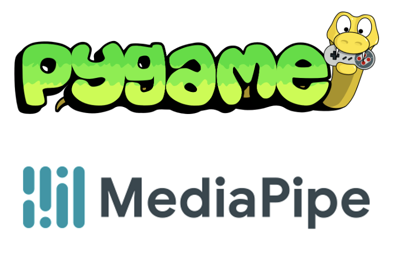

# AI Rocket Game

You're in the control station and need to drive the rocket. You need to use your head (literally) to avoid the asteroids that are about to hit you!


This poject was made with Pygame and MediaPipe:




## Installation

Set a virtual environment after clone the project
```sh
python3 -m venv venv
```

Activate the virtual environment
```sh
source venv/bin/activate
```

Install the dependencies.

```sh
pip install -r requirements.txt
```

Reun the project

```sh
python3 main.py
```


**Enjoy!**

